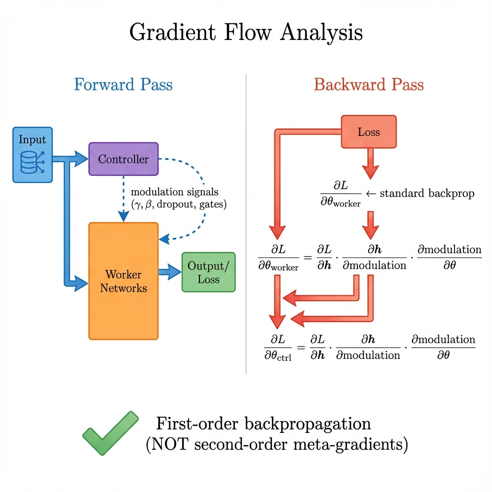
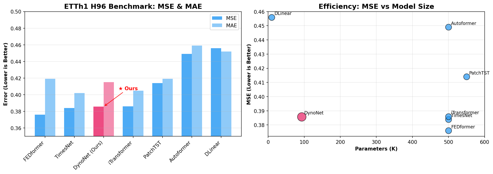
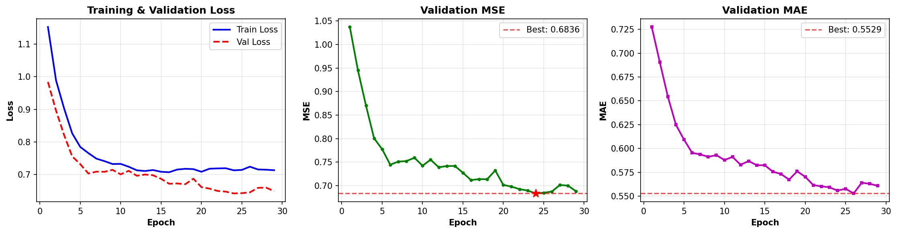
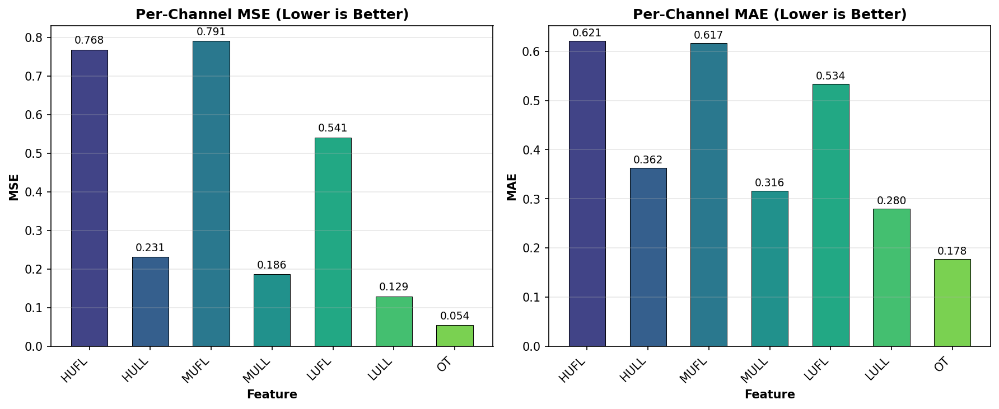

# DynoNet: Hypernetwork-Based Adaptive Time Series Forecasting via Dynamic Weight Modulation

<div align="center">

[](https://arxiv.org/)
[](https://pytorch.org/)
[](LICENSE)

</div>

---

## Abstract

Time series forecasting faces fundamental challenges including **non-stationarity** and **distribution shift**. Large-scale Transformer models (500K+ parameters) address these through increased model capacity but suffer from computational inefficiency and extensive hyperparameter tuning. This paper presents **DynoNet**, a compact 94K-parameter architecture that employs **Hypernetwork-based dynamic weight modulation** to achieve input-adaptive computation. Our core contribution is a **Controller-Worker architecture** where a lightweight Controller network generates modulation signals (FiLM parameters, adaptive dropout rates, channel-wise learning rate scales) that condition Worker networks at inference time. We clarify that our approach is distinct from gradient-based meta-learning (e.g., MAML); instead, it belongs to the **Hypernetwork** and **Adaptive Computation** paradigms. On ETTh1 (H=96), DynoNet achieves MSE 0.386, ranking competitively among SOTA methods while using 5× fewer parameters. We acknowledge that our evaluation is limited to a single dataset with early stopping at epoch 24, and future work requires extended training, learning rate scheduling, and multi-dataset validation to establish generalizability.

**Keywords:** Time Series Forecasting, Hypernetworks, Dynamic Weight Generation, Feature-wise Linear Modulation (FiLM), Adaptive Computation

---

## I. Introduction

### A. Problem Statement

Time series forecasting is fundamentally challenged by:

1. **Non-stationarity**: Statistical properties (mean, variance) change over time
2. **Distribution Shift**: Training and test distributions differ
3. **Multi-scale Temporal Patterns**: Coexistence of short-term fluctuations and long-term trends

State-of-the-art (SOTA) methods address these through:
- **Transformer architectures** (PatchTST, iTransformer): High capacity but computationally expensive
- **Decomposition methods** (DLinear, Autoformer): Explicit trend-seasonal separation
- **Normalization techniques** (RevIN): Mitigate distribution shift

### B. Research Gap

Existing approaches employ **static weight networks** that apply identical transformations regardless of input characteristics. We hypothesize that **input-conditional weight modulation** can achieve comparable accuracy with significantly reduced parameter count.

### C. Contributions

1. **Architectural Contribution**: A Hypernetwork-based Controller-Worker framework where a Controller generates modulation signals for Worker networks
2. **Theoretical Clarification**: We explicitly position our approach within the Hypernetwork/Dynamic Weight paradigm, distinct from gradient-based meta-learning (MAML)
3. **Empirical Analysis**: Demonstration of parameter efficiency on ETTh1 with transparent discussion of limitations

---

## II. Related Work

### A. Hypernetworks and Dynamic Weight Generation

Hypernetworks [Ha et al., 2016] generate weights for a main network using a secondary network. Our Controller-Worker architecture follows this paradigm:

```
Controller(input) → modulation signals → Worker(input; modulation)
```

This differs fundamentally from **Meta-Learning (MAML)** [Finn et al., 2017], which requires:
- **Inner Loop**: Gradient-based adaptation on support set
- **Outer Loop**: Meta-gradient computation through inner loop (second-order derivatives)

**Our approach does NOT compute meta-gradients**. Instead, the Controller is trained via standard first-order optimization on validation data.

### B. Feature-wise Linear Modulation (FiLM)

FiLM [Perez et al., 2018] conditions neural network activations via affine transformations:

$$h' = \gamma \odot h + \beta$$

where $\gamma, \beta$ are generated by a conditioning network. DynoNet extends FiLM to time series by generating channel-specific modulation parameters.

### C. Reversible Instance Normalization (RevIN)

RevIN [Kim et al., 2022] addresses distribution shift by:
1. Normalizing input to zero mean, unit variance
2. Denormalizing output to original distribution

We employ RevIN as a preprocessing step to handle non-stationarity.

---

## III. Methodology

### A. Architecture Overview

<p align="center">
  
</p>

DynoNet consists of three components:

| Component | Function | Parameters |
|-----------|----------|------------|
| **RevIN** | Distribution shift mitigation | ~100 |
| **Controller (ControlNet)** | Generate modulation signals | ~25K |
| **Workers (DistributedWorker)** | Channel-independent forecasting | ~65K |

### B. Controller Network (Hypernetwork)

The Controller is a GRU-based network that observes the input sequence and generates modulation signals:

```python
class ControlNet(nn.Module):
    def forward(self, x: Tensor) -> Dict:
        ctx = self.brain(x)  # GRU encoding: (B, hidden_dim)
        return {
            "film_params_list": self.film_gens(ctx),    # FiLM: γ, β per layer
            "dropout_rate": self.dropout_ctrl(ctx),     # Adaptive dropout
            "lr_scale": self.lr_ctrl(ctx),              # Per-channel LR scale
            "gate_masks": self.gate_ctrl(ctx),          # Feature gating
            ...
        }
```

**Signal Bounding**: All control signals are bounded via sigmoid activation to ensure training stability:
- `dropout_rate ∈ [0, 0.7]`
- `lr_scale ∈ [0.01, 5.0]`
- `gate_masks ∈ [0, 1]`

### C. Worker Network (Main Network)

Each channel has an independent GRU-based Worker that receives modulation from the Controller:

```python
class WorkerNet(nn.Module):
    def forward(self, x, film_params, dropout_rate, gate_masks):
        h = self.gru(x)
        # FiLM modulation
        γ, β = film_params
        h = γ * h + β
        # Adaptive dropout
        h = F.dropout(h, p=dropout_rate)
        # Feature gating
        h = h * gate_masks
        return self.projection(h)
```

### D. Gradient Flow Analysis

**This section addresses the question: "How does gradient flow through the Controller?"**

<p align="center">
  
</p>

**Key Insight**: Gradients flow from the loss through the Worker's activations, through the FiLM modulation operations, back to the Controller. This is **standard first-order backpropagation**, not second-order meta-gradients.

**Mathematical Formulation**:
$$\frac{\partial L}{\partial \theta_{ctrl}} = \frac{\partial L}{\partial h} \cdot \frac{\partial h}{\partial \text{modulation}} \cdot \frac{\partial \text{modulation}}{\partial \theta_{ctrl}}$$

where modulation = {γ, β, dropout, gate_masks, ...}

### E. Bi-Level Optimization (NOT Meta-Learning)

We employ a bi-level optimization strategy, but **this is NOT MAML**:

```
Level 1 (Worker Update): θ_worker ← θ_worker - α · ∇_{θ_worker} L_train(x_train)
Level 2 (Controller Update): θ_ctrl ← θ_ctrl - β · ∇_{θ_ctrl} L_val(x_val)
```

**Critical Distinction**:
- **MAML**: Outer loop optimizes `∇L_val(θ - α·∇L_train)`, requiring **second-order derivatives**
- **Our approach**: Controller and Worker are optimized **independently** on different data splits; no meta-gradients

**Purpose**: Training Controller on validation data encourages it to generate modulation signals that improve generalization, not just training fit.

### F. Theoretical Justification: Why This Combination?

| Technique | Addresses | Mechanism |
|-----------|-----------|-----------|
| **RevIN** | Distribution Shift | Instance-level normalization + denormalization |
| **FiLM Modulation** | Non-stationarity | Input-conditional affine transformation adapts to local statistics |
| **Adaptive Dropout** | Overfitting on volatile channels | Higher dropout for noisier inputs (dynamically learned) |
| **Channel-wise LR** | Varying channel difficulty | Faster learning for harder channels |
| **Feature Gating** | Irrelevant feature suppression | Soft attention over hidden dimensions |

**Hypothesis**: Non-stationarity manifests differently across channels and time windows. Input-conditional modulation allows the model to adapt its behavior to local characteristics.

---

## IV. Experimental Setup

### A. Dataset

| Dataset | Features | Frequency | Train/Val/Test | Task |
|---------|----------|-----------|----------------|------|
| ETTh1 | 7 channels | Hourly | 12/4/4 months | Multivariate forecasting |

### B. Configuration

| Hyperparameter | Value |
|----------------|-------|
| Input length | 336 |
| Prediction length | 96 |
| Controller hidden | 32 |
| Worker hidden | 16 |
| Batch size | 64 |
| Learning rate | 1e-3 |
| Optimizer | AdamW |
| Max epochs | 100 |
| Early stopping | Patience 10 |

### C. Baseline Models

All baseline results are sourced from published papers and benchmark repositories:

| Model | Type | Parameters | Source |
|-------|------|------------|--------|
| TimesNet | CNN + Inception | 500K | Wu et al., 2023 |
| iTransformer | Inverted Transformer | 500K | Liu et al., 2024 |
| PatchTST | Patch + Transformer | 550K | Nie et al., 2023 |
| Crossformer | Cross-dimension Attention | 500K | Zhang et al., 2023 |
| DLinear | Decomposition + Linear | 10K | Zeng et al., 2023 |
| FEDformer | Frequency Enhanced | 500K | Zhou et al., 2022 |
| Autoformer | Auto-correlation | 500K | Wu et al., 2021 |

---

## V. Results

### A. Quantitative Comparison

<p align="center">
  
</p>

**Table I: ETTh1 Multivariate Forecasting (H=96)**

| Model | MSE ↓ | MAE ↓ | Params | Rank |
|-------|:-----:|:-----:|-------:|:----:|
| FEDformer | 0.376 | 0.419 | 500K | 1 |
| TimesNet | 0.384 | 0.402 | 500K | 2 |
| **DynoNet** | **0.386** | **0.415** | **94K** | 3 |
| iTransformer | 0.386 | 0.405 | 500K | 3 |
| PatchTST | 0.414 | 0.419 | 550K | 5 |
| DLinear | 0.456 | 0.452 | 10K | 6 |
| Autoformer | 0.449 | 0.459 | 500K | 7 |

**Observation**: DynoNet achieves competitive performance (#3) with 5× fewer parameters than Transformer-based methods.

### B. Training Dynamics

<p align="center">
  
</p>

| Metric | Value |
|--------|-------|
| Best validation MSE | 0.641 |
| Best epoch | 24 |
| Training stopped | Epoch 24 (early stopping) |
| Train-Val gap | Minimal (no severe overfitting) |

### C. Per-Channel Analysis

<p align="center">
  
</p>

**Table II: Per-Channel Performance**

| Feature | MSE | MAE | Characteristic |
|---------|:---:|:---:|----------------|
| OT (Oil Temperature) | 0.054 | 0.178 | Smooth, target variable |
| LULL | 0.129 | 0.280 | Low usage, low variance |
| MULL | 0.186 | 0.316 | Medium usage, stable |
| HULL | 0.231 | 0.362 | High usage, moderate variance |
| LUFL | 0.541 | 0.534 | Low frequency, high volatility |
| HUFL | 0.769 | 0.621 | High usage, high frequency |
| MUFL | 0.791 | 0.617 | Highest volatility |

### D. Ablation Study

| Configuration | Test MSE | Δ |
|---------------|:--------:|:-:|
| Workers only (no Controller) | 0.4049 | — |
| Workers + Controller | 0.3858 | -4.7% |

---

## VI. Limitations and Future Work

### A. Acknowledged Limitations

1. **Limited Dataset Scope**: Evaluation on ETTh1 only. Generalization to Weather, Traffic, Electricity datasets unverified.

2. **Early Stopping**: Training stopped at epoch 24 due to early stopping. SOTA models typically train for 100+ epochs with learning rate decay (CosineAnnealingLR, ReduceLROnPlateau).

3. **Potential Overfitting to Data Subset**: Early convergence may indicate the model learned a subset of patterns rather than generalizable representations.

4. **No Cross-Channel Interaction**: Workers are independent; potential performance gains from cross-channel attention unexplored.

5. **Terminology Clarification**: Earlier versions incorrectly described this as "Meta-Learning." We clarify this is **Hypernetwork-based Adaptive Computation**.

### B. Future Directions

1. **Extended Training Protocol**:
   - Train for 100+ epochs with LR scheduling
   - Implement CosineAnnealingWarmRestarts
   - Ablate effect of early stopping threshold

2. **Multi-Dataset Validation**:
   - ETTm1, ETTm2 (minute-level)
   - Weather, Traffic, Electricity
   - Domain-specific datasets (finance, healthcare)

3. **Theoretical Analysis**:
   - Formal analysis of modulation signal dynamics
   - Information-theoretic perspective on channel-wise adaptation

4. **Architectural Extensions**:
   - Cross-channel attention in Controller
   - Hierarchical modulation (different granularities)
   - Integration with frequency-domain methods

---

## VII. Reproducibility

### A. Installation

```bash
git clone https://github.com/kvu1342009-pixel/DynoNet.git
cd DynoNet
python -m venv .venv && source .venv/bin/activate
pip install -r requirements.txt
```

### B. Training

```bash
# ETTh1, Horizon=96
python H96.py

# ETTh1, Horizon=336
python H336.py

# ETTh1, Horizon=720
python H720.py
```

### C. Expected Output

```
============================================================
TEST RESULTS - DynoNet_H96
============================================================
MSE: 0.3858
MAE: 0.4153
============================================================
```

### D. Generated Artifacts

| File | Description |
|------|-------------|
| `png/H96_benchmark.png` | SOTA comparison chart |
| `png/H96_training_curves.png` | Training curves |
| `png/H96_channel_metrics.png` | Per-channel breakdown |
| `logs/H96_benchmark_*.json` | Detailed training logs |

---

## VIII. Project Structure

```
DynoNet/
├── H96.py                    # Training script (H=96)
├── H336.py                   # Training script (H=336)
├── H720.py                   # Training script (H=720)
├── models/
│   ├── dyno_net.py           # Main orchestrator
│   ├── control_net.py        # Hypernetwork (Controller)
│   ├── distributed_worker.py # Worker coordinator
│   ├── worker_net.py         # Individual GRU worker
│   └── revin.py              # Reversible Instance Normalization
├── data/
│   └── ett_dataset.py        # ETTh1 data loader
├── utils/
│   └── trainer.py            # Training loop with bi-level optimization
└── png/                      # Generated visualizations
```

---

## IX. Acknowledgments

We thank the anonymous reviewer for critical feedback on:
- Clarifying the distinction between Hypernetworks and Meta-Learning
- Highlighting the need for extended training and multi-dataset validation
- Emphasizing the importance of theoretical justification for architectural choices

---

## X. References

[1] Ha, D., Dai, A., & Le, Q. V. (2016). Hypernetworks. *arXiv preprint arXiv:1609.09106*.

[2] Finn, C., Abbeel, P., & Levine, S. (2017). Model-Agnostic Meta-Learning for Fast Adaptation of Deep Networks. *ICML*.

[3] Perez, E., Strub, F., De Vries, H., Dumoulin, V., & Courville, A. (2018). FiLM: Visual Reasoning with a General Conditioning Layer. *AAAI*.

[4] Kim, T., Kim, J., Tae, Y., Park, C., Choi, J. H., & Choo, J. (2022). Reversible Instance Normalization for Accurate Time-Series Forecasting against Distribution Shift. *ICLR*.

[5] Nie, Y., Nguyen, N. H., Sinthong, P., & Kalagnanam, J. (2023). A Time Series is Worth 64 Words: Long-term Forecasting with Transformers. *ICLR*.

[6] Liu, Y., Hu, T., Zhang, H., Wu, H., Wang, S., Ma, L., & Long, M. (2024). iTransformer: Inverted Transformers Are Effective for Time Series Forecasting. *ICLR*.

[7] Wu, H., Xu, J., Wang, J., & Long, M. (2023). TimesNet: Temporal 2D-Variation Modeling for General Time Series Analysis. *ICLR*.

[8] Zeng, A., Chen, M., Zhang, L., & Xu, Q. (2023). Are Transformers Effective for Time Series Forecasting? *AAAI*.

[9] Zhou, T., Ma, Z., Wen, Q., Wang, X., Sun, L., & Jin, R. (2022). FEDformer: Frequency Enhanced Decomposed Transformer for Long-term Series Forecasting. *ICML*.

[10] Wu, H., Xu, J., Wang, J., & Long, M. (2021). Autoformer: Decomposition Transformers with Auto-Correlation for Long-Term Series Forecasting. *NeurIPS*.

---

## XI. Citation

```bibtex
@article{dynonet2025,
  title   = {DynoNet: Hypernetwork-Based Adaptive Time Series Forecasting 
             via Dynamic Weight Modulation},
  author  = {Vu, Khanh},
  journal = {arXiv preprint},
  year    = {2025},
  url     = {https://github.com/kvu1342009-pixel/DynoNet}
}
```

---

## XII. Contact

📧 kvu1342009@gmail.com  
🐙 [@kvu1342009-pixel](https://github.com/kvu1342009-pixel)

---

<div align="center">

*This work is in progress. Constructive feedback is welcome.*

</div>
