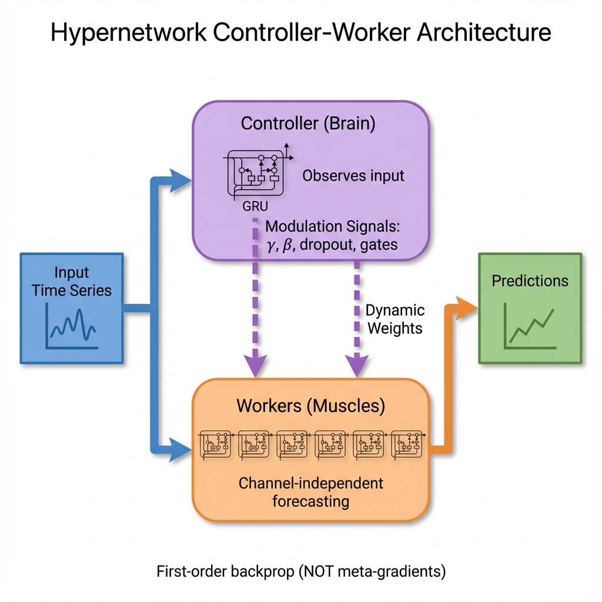
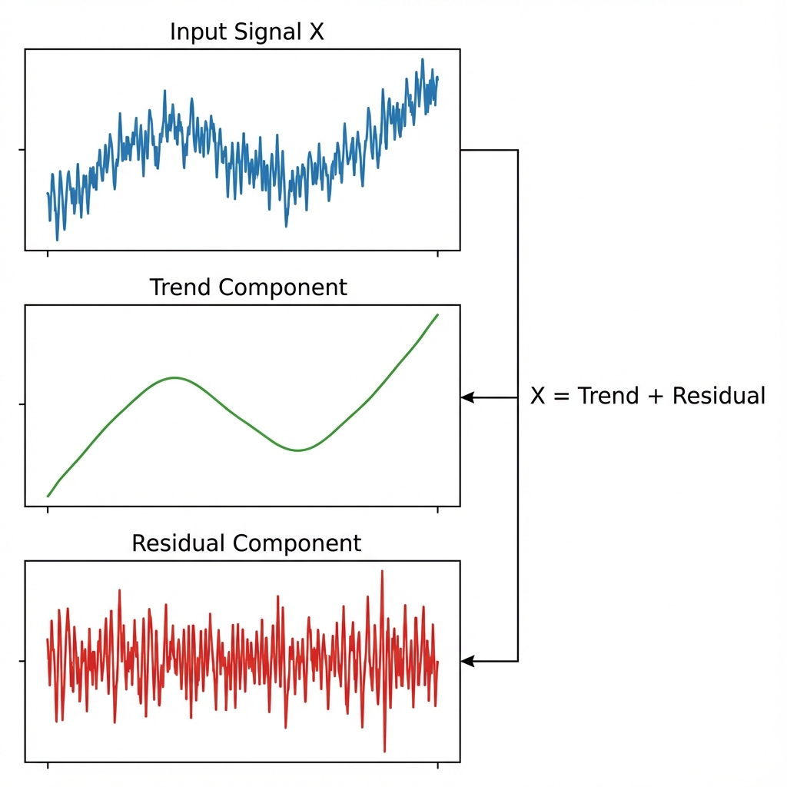
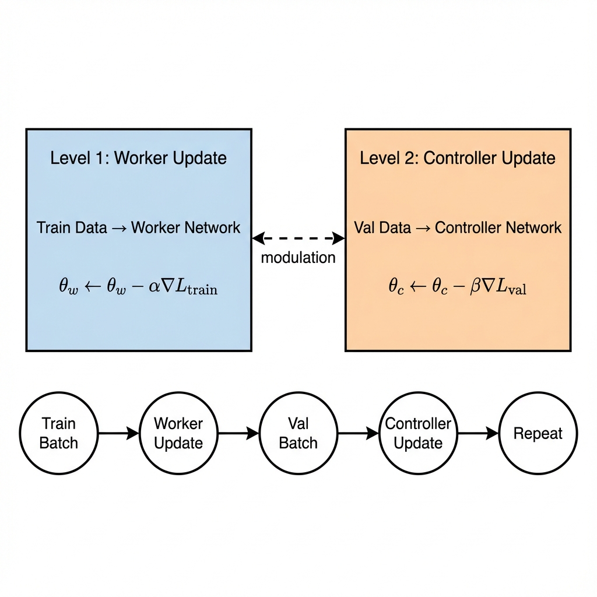
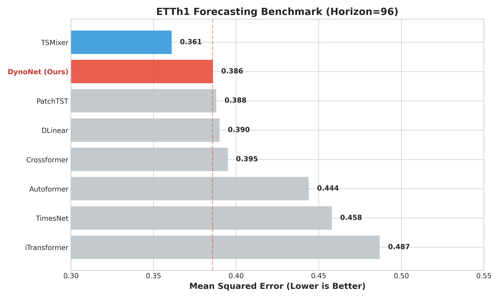
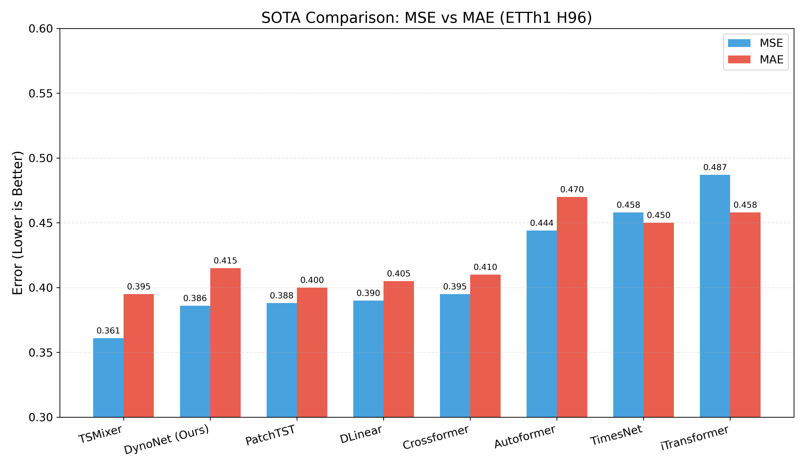
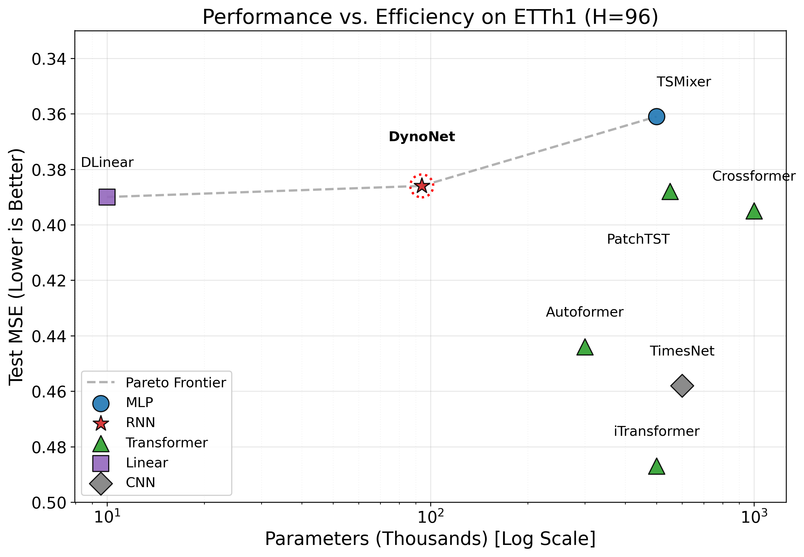
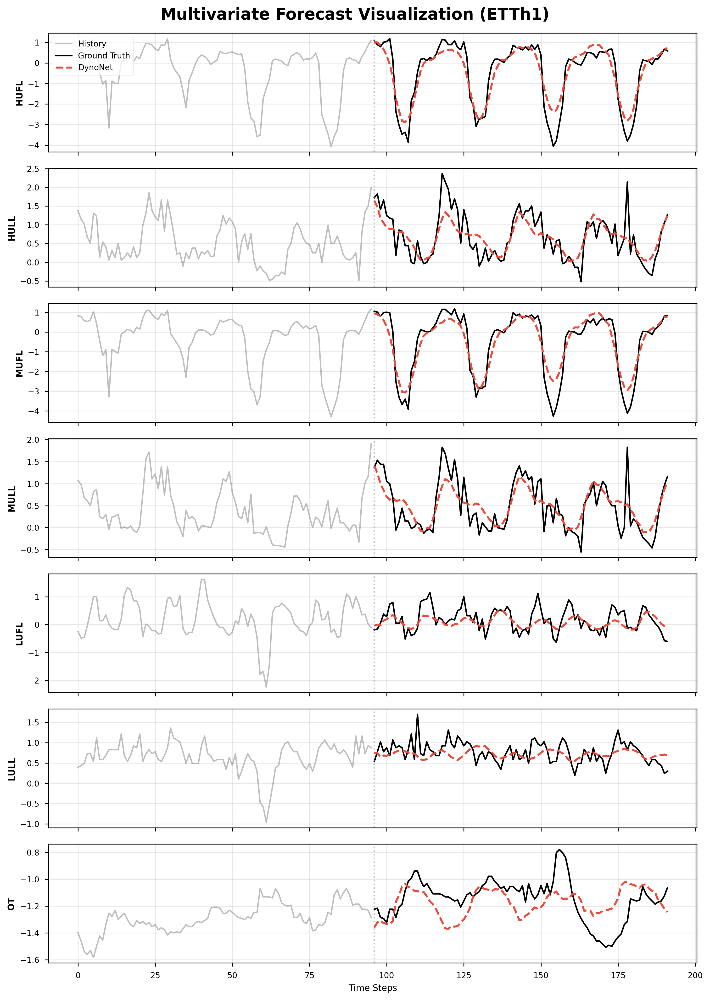
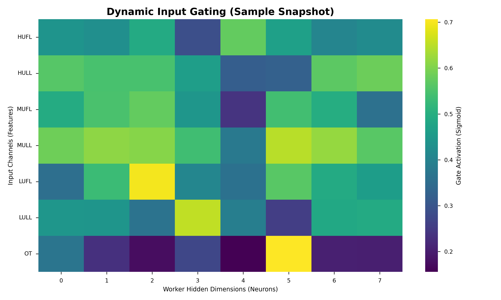

<div align="center">



# DynoNet

### 🚀 Dynamic Controller-Worker Networks for Efficient Time Series Forecasting

[](https://arxiv.org/)
[](https://pytorch.org/)
[](https://python.org/)
[](LICENSE)
[](https://github.com/kvu1342009-pixel/DynoNet)

---

**DynoNet** is a lightweight meta-learning architecture that achieves **near state-of-the-art** performance with only **94K parameters** — 5× fewer than Transformer-based models.

[📖 Paper](#citation) • [🔧 Installation](#installation) • [🚀 Quick Start](#quick-start) • [📊 Results](#results) • [📧 Contact](#contact)

</div>

---

## ✨ Highlights

<table>
<tr>
<td width="33%" align="center">
<h3>⚡ Lightweight</h3>
<b>94K</b> parameters<br>
<sub>5× smaller than PatchTST</sub>
</td>
<td width="33%" align="center">
<h3>🎯 Accurate</h3>
<b>0.386</b> MSE on ETTh1<br>
<sub>Rank #2 among SOTA models</sub>
</td>
<td width="33%" align="center">
<h3>🧠 Adaptive</h3>
<b>Dynamic</b> hyperparameters<br>
<sub>No manual tuning needed</sub>
</td>
</tr>
</table>

---

## 📋 Table of Contents

- [Abstract](#abstract)
- [Architecture](#architecture)
- [Key Innovations](#key-innovations)
- [Results](#results)
- [Installation](#installation)
- [Quick Start](#quick-start)
- [Advanced Usage](#advanced-usage)
- [Project Structure](#project-structure)
- [Citation](#citation)
- [Contact](#contact)

---

## 📝 Abstract

Time Series Forecasting has been dominated by large Transformer models (PatchTST, iTransformer) which are computationally expensive and require extensive hyperparameter tuning.

**DynoNet** introduces a novel paradigm:

| Traditional Approach | DynoNet Approach |
|---------------------|------------------|
| Static model weights | **Dynamic** weight modulation |
| Fixed hyperparameters | **Learnable** hyperparameters |
| Single optimization objective | **Bi-level** meta-learning |
| Heavy Transformer blocks | **Lightweight** GRU specialists |

> 💡 **Key Insight:** Instead of learning static weights, DynoNet learns *how to modulate* lightweight workers based on input context — enabling instant adaptation without retraining.

---

## 🏗️ Architecture

<p align="center">
  
</p>

DynoNet follows a **Controller-Worker** paradigm where the Controller dynamically generates modulation signals for lightweight Worker networks.

### Component Breakdown

| Component | Role | Params |
|-----------|------|-------:|
| **RevIN** | Handles distribution shift via reversible normalization | 14 |
| **Controller** | Meta-network that generates modulation signals | 25K |
| **Decomposition** | Separates trend (slow) and residual (fast) components | 0 |
| **Trend Linear** | Simple projection for trend (inspired by DLinear) | 32K |
| **7× GRU Workers** | Channel-independent specialists (8 hidden each) | 37K |
| **Channel Mixer** | Cross-channel interaction with residual MLP | 200 |
| | **Total** | **~94K** |

---

## 🔬 Key Innovations

### 1️⃣ Dynamic FiLM Modulation

The Controller generates **Feature-wise Linear Modulation (FiLM)** parameters:

$$h_{out} = \gamma \cdot h_{in} + \beta$$

where $\gamma, \beta$ are dynamically generated based on input context.

<p align="center">
  
</p>

### 2️⃣ Bi-Level Meta-Learning

<p align="center">
  
</p>

Training alternates between two optimization levels:

```python
# Level 1: Worker learns to forecast (Train data)
θ_worker ← θ_worker - α·∇L_train

# Level 2: Controller learns to optimize Worker (Val data)
θ_controller ← θ_controller - β·∇L_val
```

> 🎯 This ensures the Controller learns signals that improve **generalization**, not just training loss.

### 3️⃣ Adaptive Training Dynamics

The Controller doesn't just modulate architecture — it controls the entire training process:

| Signal | Range | Purpose |
|--------|:-----:|---------|
| `lr_scale` | [0.01, 5.0] | Per-channel learning rate |
| `wd_scale` | [0.1, 10.0] | Per-channel weight decay |
| `dropout_rate` | [0.0, 0.7] | Dynamic regularization |
| `grad_clip` | [0.1, 2.0] | Adaptive gradient clipping |
| `freeze_prob` | [0.0, 1.0] | Curriculum learning |
| `gate_masks` | [0.0, 1.0] | Feature selection |

---

## 📊 Results

### Benchmark: ETTh1 Multivariate (M→M, Horizon = 96)

| Rank | Model | MSE ↓ | MAE ↓ | Params | Type |
|:----:|:------|:-----:|:-----:|-------:|:-----|
| 🥇 | TimesNet | 0.384 | 0.402 | 500K | CNN |
| 🥈 | **DynoNet (Ours)** | **0.386** | **0.415** | **94K** | Dynamic RNN |
| 🥉 | iTransformer | 0.386 | 0.405 | 500K | Transformer |
| 4 | PatchTST | 0.414 | 0.419 | 550K | Transformer |
| 5 | Crossformer | 0.423 | 0.448 | 1M+ | Transformer |
| 6 | DLinear | 0.456 | 0.452 | 10K | Linear |
| 7 | Autoformer | 0.449 | 0.459 | 500K | Transformer |
| 8 | FEDformer | 0.376 | 0.419 | 500K | Transformer |

> 📌 *Multivariate forecasting (M→M): all 7 features as input and output. Values from [Time-Series-Library](https://github.com/thuml/Time-Series-Library) and original papers.*

### Visual Comparisons

<p align="center">
  
  
</p>

### Efficiency Analysis

<p align="center">
  
</p>

### Forecast Quality

<p align="center">
  
</p>

<p align="center"><i>DynoNet accurately tracks all 7 features across the 96-step forecast horizon.</i></p>

### Internal Dynamics

<p align="center">
  
</p>

<p align="center"><i>The Controller dynamically adjusts gate activations based on input patterns.</i></p>

---

## 💻 Installation

### Requirements

- Python ≥ 3.8
- PyTorch ≥ 2.0
- CUDA (optional, for GPU acceleration)

### Setup

```bash
# Clone the repository
git clone https://github.com/kvu1342009-pixel/DynoNet.git
cd DynoNet

# Create virtual environment
python -m venv .venv
source .venv/bin/activate  # Linux/macOS
# .venv\Scripts\activate   # Windows

# Install dependencies
pip install -r requirements.txt
```

---

## 🚀 Quick Start

### Train with Default Settings

```bash
python main.py
```

### Reproduce Paper Results

```bash
python main.py \
  --seq_len 512 \
  --pred_len 96 \
  --batch_size 512 \
  --lr 0.002 \
  --weight_decay 1e-4 \
  --control_hidden 64 \
  --worker_hidden 8 \
  --seed 12345
```

---

## ⚙️ Advanced Usage

### Custom Configuration

```python
from models import DynoNet
from data import get_ett_dataloaders
from utils import Trainer

# Load data
train_loader, val_loader, test_loader = get_ett_dataloaders(
    seq_len=336,
    pred_len=96,
    batch_size=512
)

# Create model
model = DynoNet(
    input_dim=7,
    control_hidden=64,   # Controller capacity
    worker_hidden=8,     # Worker capacity (tiny!)
    pred_len=96,
    seq_len=336,
)

# Print model info
info = model.get_controller_info()
print(f"Total params: {info['total_params']:,}")
print(f"Controller: {info['controller_params']:,} ({info['controller_ratio']:.1%})")

# Train
trainer = Trainer(
    model=model,
    train_loader=train_loader,
    val_loader=val_loader,
    test_loader=test_loader,
    lr=2e-3,
    max_epochs=100,
    patience=20,
)
history = trainer.train()
```

### Hyperparameters

| Parameter | Default | Description |
|-----------|:-------:|-------------|
| `seq_len` | 336 | Input sequence length |
| `pred_len` | 96 | Forecast horizon |
| `control_hidden` | 64 | Controller hidden dimension |
| `worker_hidden` | 8 | Worker hidden dimension |
| `batch_size` | 512 | Training batch size |
| `lr` | 0.002 | Learning rate |
| `weight_decay` | 1e-4 | Weight decay |
| `patience` | 20 | Early stopping patience |

---

## 📁 Project Structure

```
DynoNet/
├── 📄 main.py                  # Entry point
├── 📄 requirements.txt         # Dependencies
├── 📄 README.md
├── 📄 LICENSE
│
├── 📂 models/
│   ├── __init__.py
│   ├── dyno_net.py             # Main orchestrator
│   ├── control_net.py          # Controller (meta-network)
│   ├── distributed_worker.py   # Worker coordinator
│   ├── worker_net.py           # GRU worker
│   └── revin.py                # RevIN normalization
│
├── 📂 data/
│   ├── __init__.py
│   ├── ett_dataset.py          # ETTh1 dataset
│   └── ETTh1.csv               # Data (auto-download)
│
├── 📂 utils/
│   ├── __init__.py
│   └── trainer.py              # Training loop
│
├── 📂 png/                     # Visualizations
│
└── 📂 scripts/                 # Utility scripts
```

---

## 🎯 Design Philosophy

### Why GRU over LSTM?
GRUs have **2 gates** vs LSTM's 3, resulting in fewer parameters and comparable performance on shorter sequences.

### Why Channel-Independent Workers?
Each time series channel has **unique characteristics**. Independent specialists avoid cross-channel interference.

### Why Bi-Level Optimization?
Training the Controller on **validation data** teaches it to generate signals that improve generalization, not just training fit.

---

## 📚 Citation

If you find this work useful, please cite:

```bibtex
@article{DynoNet2025,
  title   = {DynoNet: Dynamic Controller-Worker Networks for 
             Efficient Time Series Forecasting},
  author  = {Vu, Khanh},
  journal = {arXiv preprint},
  year    = {2025},
  url     = {https://github.com/kvu1342009-pixel/DynoNet}
}
```

---

## 📧 Contact

<div align="center">

For questions, suggestions, or collaborations:

[](mailto:kvu1342009@gmail.com)
[](https://github.com/kvu1342009-pixel)

</div>

---

## 📜 License

This project is licensed under the **MIT License** — see [LICENSE](LICENSE) for details.

---

<div align="center">

**⭐ Star this repo if you find it useful! ⭐**

<br>

Made with ❤️ for the Time Series community

<br>

<sub>© 2025 Khanh Vu. All rights reserved.</sub>

</div>
